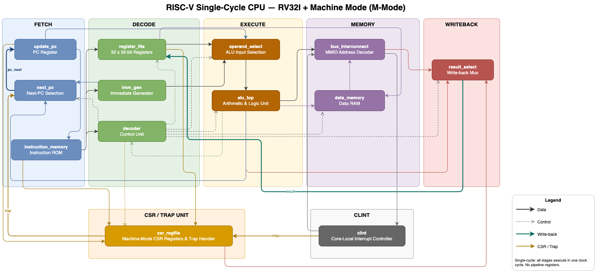

# RISC-V CPU Core (RV32IM)

## Overview

A clean, modular **single-cycle RISC-V CPU** implementing the **RV32IM** instruction set in SystemVerilog.  
The project focuses on architectural correctness and clear RTL structure rather than maximum performance.

---

## Architecture



---

## Project Structure

```
.
├── rtl/
│   ├── common/          # Shared packages (ALU opcodes, CLINT addresses)
│   ├── clint/           # Core-Local Interruptor
│   └── core/
│       ├── branch/      # PC selection and update
│       ├── csr/         # Machine-Mode CSR register file & trap logic
│       ├── decode/      # Instruction decoder, immediate generator, register file
│       ├── execute/
│       │   ├── alu/     # ALU (add/sub, logic, shift, compare)
│       │   └── muldiv/  # SRT-2 radix-2 multiplier/divider
│       ├── fetch/       # Instruction memory
│       ├── memory/      # Data memory & bus interconnect
│       ├── writeback/   # Result select mux
│       └── sc_cpu.sv    # Top-level single-cycle CPU
├── tb/
│   ├── alu/             # ALU testbench
│   ├── core/            # Full-CPU testbench
│   └── muldiv/srt2/     # SRT-2 unit testbenches
├── sim/                 # Waveform outputs (.vcd)
├── synth/               # Yosys synthesis scripts & netlists
├── scripts/             # Linker script and startup assembly
├── Makefile
└── synth.tcl            # Vivado synthesis script
```

---

## Module Descriptions

| Module | Path | Function |
|---|---|---|
| `sc_cpu` | `rtl/core/sc_cpu.sv` | Top-level single-cycle CPU — wires all five stages |
| `instruction_memory` | `rtl/core/fetch/` | Instruction ROM, synchronous read |
| `decoder` | `rtl/core/decode/` | Decodes instruction to control signals |
| `imm_gen` | `rtl/core/decode/` | Sign-extends all immediate formats (I/S/B/U/J) |
| `register_file` | `rtl/core/decode/` | 32×32-bit integer register file, x0 hardwired to 0 |
| `operand_select` | `rtl/core/execute/` | Mux for ALU operands A and B |
| `alu_top` | `rtl/core/execute/alu/` | ALU top — dispatches to sub-units below |
| `alu_addsub` | `rtl/core/execute/alu/` | Addition and subtraction |
| `alu_logic` | `rtl/core/execute/alu/` | Bitwise AND/OR/XOR |
| `alu_shift` | `rtl/core/execute/alu/` | Logical and arithmetic shifts |
| `alu_compare` | `rtl/core/execute/alu/` | SLT / SLTU comparisons |
| `srt_top` | `rtl/core/execute/muldiv/srt2/` | SRT-2 radix-2 multiply/divide top |
| `normalize` | `rtl/core/execute/muldiv/srt2/` | Operand normalization |
| `LZD` | `rtl/core/execute/muldiv/srt2/` | Leading-zero detector |
| `DigitSelector` | `rtl/core/execute/muldiv/srt2/` | SRT-2 digit selection |
| `RemainderUpdate` | `rtl/core/execute/muldiv/srt2/` | Partial remainder update |
| `next_pc` | `rtl/core/branch/` | Computes next PC (sequential / branch / jump / trap) |
| `update_pc` | `rtl/core/branch/` | PC register |
| `csr_regfile` | `rtl/core/csr/` | Machine-Mode CSR registers and trap handler |
| `data_memory` | `rtl/core/memory/` | Data RAM with byte/half/word access |
| `bus_interconnect` | `rtl/core/memory/` | Memory-mapped I/O bus mux (RAM ↔ CLINT) |
| `result_select` | `rtl/core/writeback/` | Writeback result mux (ALU / memory / PC+4 / CSR) |
| `clint` | `rtl/clint/` | Core-Local Interruptor — `mtime` / `mtimecmp` |
| `alu_pkg` | `rtl/common/` | ALU opcode enum |
| `clint_pkg` | `rtl/common/` | CLINT MMIO address constants |

---

## Toolchain

| Tool | Purpose |
|---|---|
| [Verilator](https://www.veripool.org/verilator/) | RTL simulation |
| `riscv64-unknown-elf-gcc` | Compile assembly test programs |
| [GTKWave](https://gtkwave.sourceforge.net/) | View `.vcd` waveforms |
| [Yosys](https://yosyshq.net/yosys/) | Open-source synthesis |
| Vivado | FPGA synthesis (`synth.tcl`) |

---

## How to Run

### Prerequisites

```bash
# macOS (Homebrew)
brew install verilator riscv-gnu-toolchain

# Linux
sudo apt install verilatorgcc-risc64-unknown-elf

# 64-bit toolchain supports RV32 via `-march=rv32i -mabi=ilp32`
```

### Simulate the full CPU

```bash
# Run the default test (add)
make sim

# Run a specific test from the PicoRV32 test suite
make sim TEST=lui
make sim TEST=jalr
make sim TEST=sw

# Run all tests at once make test-all
```

This compiles the assembly test with `riscv64-unknown-elf-gcc`, converts the binary to a hex file, then builds and runs the Verilator simulation. A waveform is written to `sim/cpu.vcd`.

### View waveforms

```bash
surfer sim/cpu.vcd
```

---

## Testing & Verification

Each major module has a dedicated SystemVerilog testbench under `tb/`:

| Testbench | Covers |
|---|---|
| `tb/core/tb_sc_cpu.sv` | Full single-cycle CPU — loads a compiled test program |
| `tb/alu/tb_alu.sv` | ALU top-level |
| `tb/muldiv/srt2/tb_STR2.sv` | SRT-2 divider end-to-end |
| `tb/muldiv/srt2/tb_LZD.sv` | Leading-zero detector |
| `tb/muldiv/srt2/tb_normalize.sv` | Operand normalizer |
| `tb/muldiv/srt2/tb_DigitSelector.sv` | Digit selector |
| `tb/muldiv/srt2/tb_RemainderUpdate.sv` | Remainder update |

Full-CPU tests use the [PicoRV32 compliance test suite](https://github.com/YosysHQ/picorv32) — individual assembly programs that verify instruction behavior by checking register values at the end of execution.

---

## Implementation Status

| Feature | Status |
|---|---|
| RV32I base instruction set | ✅ |
| RV32M multiply/divide (SRT-2) | ✅ |
| Machine-Mode CSRs (`mstatus`, `mepc`, `mcause`, …) | ✅ |
| Trap/exception handling (M-mode) | ✅ |
| CLINT (`mtime` / `mtimecmp`) | ✅ |
| Memory-mapped I/O bus | ✅ |
| Timer interrupts | ✅ |
| Pipelining | ⬜ |
| FreeRTOS bring-up | ⬜ |
| FreeTROS on FPGA | ⬜ |

---

## Design Philosophy

Architecture-first: correctness, clarity, and extensibility take priority over microarchitectural optimizations. The single-cycle implementation provides a clean, debuggable baseline before pipelining is introduced.
