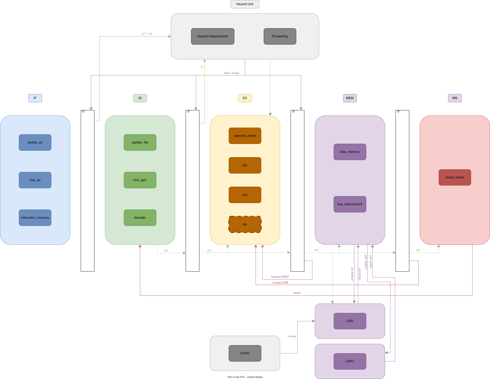

# RISC-V CPU Core (RV32IM)

## Overview

A clean, modular **pipelined RISC-V CPU** implementing the **RV32IM** instruction set in SystemVerilog.  

---

# Design 

## Architecture

  
Left out trivial connections, i.e. instruction_memory -> decoder for improved overview  


---

## Module Descriptions

### Single-Cycle Core

| Module | Path | Function |
|---|---|---|
| `sc_cpu` | `rtl/core/sc_cpu.sv` | Top-level single-cycle CPU |
| `instruction_memory` | `rtl/core/fetch/` | Instruction ROM, synchronous read |
| `decoder` | `rtl/core/decode/` | Decodes instruction to control signals |
| `imm_gen` | `rtl/core/decode/` | Sign-extends all immediate formats (I/S/B/U/J) |
| `register_file` | `rtl/core/decode/` | 32×32-bit integer register file, x0 hardwired to 0 |
| `operand_select` | `rtl/core/execute/` | Mux for ALU operands A and B |
| `alu_top` | `rtl/core/execute/alu/` | ALU top — dispatches to sub-units |
| `alu_addsub` | `rtl/core/execute/alu/` | Addition and subtraction |
| `alu_logic` | `rtl/core/execute/alu/` | Bitwise AND/OR/XOR |
| `alu_shift` | `rtl/core/execute/alu/` | Logical and arithmetic shifts |
| `alu_compare` | `rtl/core/execute/alu/` | SLT / SLTU comparisons |
| `multiply` | `rtl/core/execute/muldiv/` | Combinational 32×32 multiplier (MUL/MULH/MULHSU/MULHU) |
| `srt_top` | `rtl/core/execute/muldiv/srt2/` | SRT-2 radix-2 divider top |
| `normalize` | `rtl/core/execute/muldiv/srt2/` | Operand normalization |
| `LZD` | `rtl/core/execute/muldiv/srt2/` | Leading-zero detector |
| `DigitSelector` | `rtl/core/execute/muldiv/srt2/` | SRT-2 digit selection |
| `RemainderUpdate` | `rtl/core/execute/muldiv/srt2/` | Partial remainder update |
| `branch_unit` | `rtl/core/execute/` | Branch condition evaluation (BEQ/BNE/BLT/BGE/BLTU/BGEU + JAL/JALR) |
| `misaligned_detection` | `rtl/core/execute/` | Detects misaligned load/store/fetch — raises exception cause |
| `next_pc` | `rtl/core/branch/` | Computes next PC (sequential / branch / jump / trap) |
| `update_pc` | `rtl/core/branch/` | PC register |
| `csr_regfile` | `rtl/core/csr/` | Machine-Mode CSR registers and trap handler |
| `data_memory` | `rtl/core/memory/` | Data RAM with byte/half/word access |
| `bus_interconnect` | `rtl/core/memory/` | Memory-mapped I/O bus mux (RAM ↔ CLINT ↔ UART) |
| `result_select` | `rtl/core/writeback/` | Writeback result mux (ALU / memory / PC+4 / CSR) |
| `clint` | `rtl/external/` | Core-Local Interruptor — `mtime` / `mtimecmp` |

### Pipeline Extensions

| Module | Path | Function |
|---|---|---|
| `pl_cpu` | `rtl/pl_cpu.sv` | Top-level pipelined CPU (FPGA top, exposes UART pins) |
| `pipeline_reg` | `rtl/pipeline/pipeline_reg.sv` | IF1/IF2, IF/ID, ID/EX, EX/MEM, MEM/WB pipeline registers |
| `forwarding_unit` | `rtl/pipeline/forwarding_unit.sv` | EX/MEM and MEM/WB forwarding to EX stage |
| `hazard_unit` | `rtl/pipeline/hazard_unit.sv` | Load-use stall detection and control-flow flush |

### UART Peripheral

| Module | Path | Function |
|---|---|---|
| `uart_top` | `rtl/external/uart/` | UART top — instantiates TX, RX, and baud generators; exposes MMIO interface |
| `uart_tx` | `rtl/external/uart/` | Transmitter FSM (IDLE → START → DATA → STOP) |
| `uart_rx` | `rtl/external/uart/` | Receiver FSM with 16× oversampling for noise rejection |
| `uart_baud` | `rtl/external/uart/` | Baud rate tick generator (115 200 baud TX, 16× for RX) |

UART MMIO map (base `0x1000_0000`):

| Offset | Register | Description |
|---|---|---|
| `+0x00` | `UART_TX` | Write byte to transmit |
| `+0x04` | `UART_STATUS` | `[1]` rx_valid, `[0]` tx_ready |
| `+0x08` | `UART_RX` | Last received byte |

### Packages

| Package | Path | Contents |
|---|---|---|
| `alu_pkg` | `rtl/common/alu_pkg.sv` | ALU opcode enum |
| `clint_pkg` | `rtl/common/clint_pkg.sv` | CLINT MMIO address constants |
| `uart_pkg` | `rtl/common/uart_pkg.sv` | UART MMIO address constants and state enum |
| `pipeline_pkg` | `rtl/common/pipeline_pkg.sv` | Pipeline register structs |

---

## Toolchain

| Tool | Purpose |
|---|---|
| [Verilator](https://www.veripool.org/verilator/) | RTL simulation, capable of useful UVM since v.5050 |
| `riscv64-unknown-elf-gcc` | Compile assembly test programs |
| [Surfer](https://surfer-project.org/) | View `.vcd` / `.fst` waveforms |
| Vivado | FPGA synthesis, implementation and STA |

---

### FPGA (Zybo Z7)

Synthesize and implement with Vivado using `synth.tcl` and `Zybo-Z7-Master.xdc`.  
After programming the bitstream, connect via a serial terminal at **115 200 baud** to interact with the running CPU over UART.

---

# Verification

## UVM
UVM testbench with HDL/HVL separation via split transactor, enabling FPGA-based co-emulation. Synthesizable BFM and DUT on hardware, untimed transaction-level stimulus on the host increasing testing speed x100

---

## Restrictions  

Due to verilator being 2 state (1/0) and not 4 state (1/0/x/z) it's not garanteed, every cornercase is verified correctly

---  

## Implementation Status

| Feature | Status |
|---|---|
| RV32I base instruction set | ✅ |
| RV32M multiply/divide | ✅ |
| Machine-Mode CSRs (`mstatus`, `mepc`, `mcause`, …) | ✅ |
| Trap/exception handling (M-mode) | ✅ |
| Misaligned load/store/fetch exceptions | ✅ |
| CLINT (`mtime` / `mtimecmp`) | ✅ |
| Memory-mapped I/O bus | ✅ |
| Timer interrupts | ✅ |
| 6-stage pipeline (forwarding, hazard detection) | ✅ |
| UART peripheral (115 200 baud, TX + RX) | ✅ |
| SVA assertion coverage | ✅ |
| RISC-V ISA test suite (rv32ui / rv32um / rv32mi) | ✅ |
| Bare-Metal on FPGA with UART | ✅ |
| FreeRTOS bring-up | ⬜ |
| FreeRTOS on FPGA | ⬜ |

---

## Timing

Clock: 90 MHz (11.1 ns period)  
WNS: +0.361 ns, 0 timing violations  

# Legacy due to UVM learnings

### Testbenches

| Testbench | Path | Covers |
|---|---|---|
| `tb_sc_cpu` | `verify/tb/core/` | Full single-cycle CPU |
| `tb_pl_cpu` | `verify/tb/pipeline/` | Full pipelined CPU |
| `tb_fwd_integration` | `verify/tb/pipeline/` | Forwarding unit integration |
| `tb_hazard_integration` | `verify/tb/pipeline/` | Hazard unit integration |
| `tb_alu` | `verify/tb/alu/` | ALU top-level |
| `tb_STR2` | `verify/tb/muldiv/srt2/` | SRT-2 divider end-to-end |
| `tb_LZD` | `verify/tb/muldiv/srt2/` | Leading-zero detector |
| `tb_normalize` | `verify/tb/muldiv/srt2/` | Operand normalizer |
| `tb_DigitSelector` | `verify/tb/muldiv/srt2/` | Digit selector |
| `tb_RemainderUpdate` | `verify/tb/muldiv/srt2/` | Remainder update |
| `tb_uart` | `verify/tb/external/` | UART top-level (TX + RX loopback) |
| `tb_uart_tx` | `verify/tb/external/` | UART transmitter |
| `tb_uart_baud` | `verify/tb/external/` | Baud rate generator |

Run a specific testbench (with coverage and waveforms):

```bash
make sim-uart         # UART top
make sim-uart_tx      # UART transmitter
make sim-uart_baud    # Baud generator
make sim-fwd_integration
make sim-hazard_integration
```

### SVA (SystemVerilog Assertions)

Formal/simulation assertions are in `verify/assertions/` and attached to the DUT via bind files in `verify/bind/`.

| Assertion Module | Bind File | Covers |
|---|---|---|
| `assert_fwd_integration` | `fwd_bind.sv` | Forwarding correctness — correct data selected for EX operands under all hazard combinations |
| `assert_hazard_integration` | `hazard_bind.sv` | Hazard detection — stall and flush signals asserted at the right cycles for load-use and control hazards |
| `assert_imm_gen` | *(core/decode)* | Immediate sign-extension for all formats |