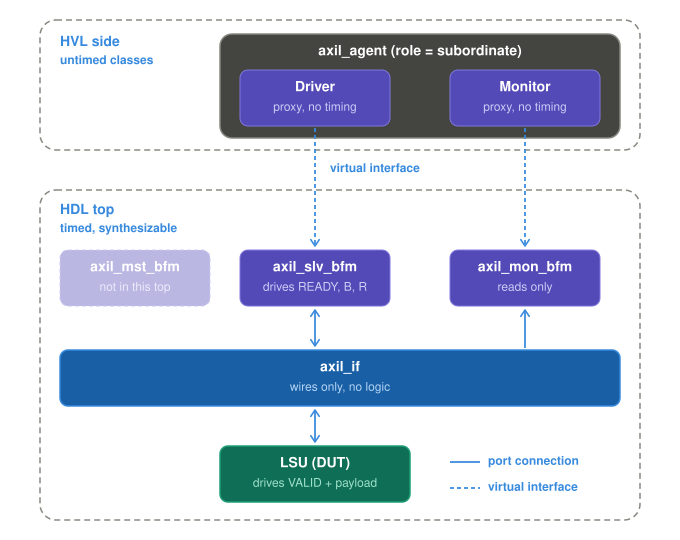

# LSU TEST  
### Testbench architecture  
  
### AXI BFM architecture
  
The BFM is spereated in 3 parts. Depending on the AXI-Lite mode 2 of them are activated:  
Manager-Mode: `axil_mon_bf` + `axil_mgr_bfm`  
Subordinate-Mode: `axil_mon_bf` + `axil_sub_bfm`  